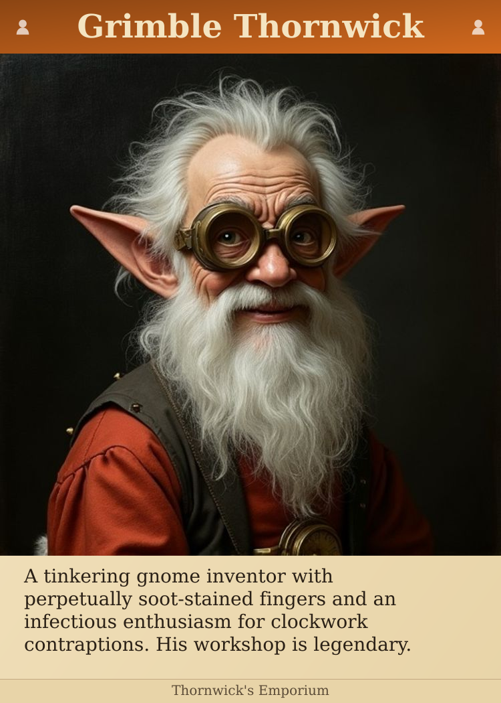
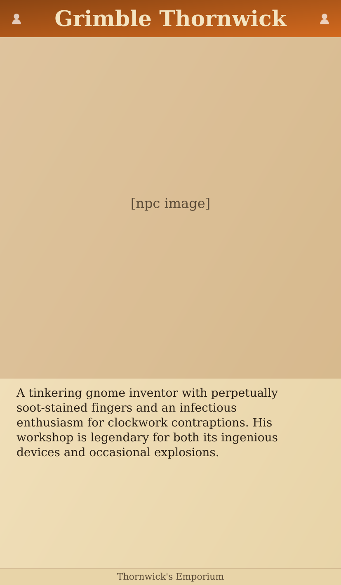
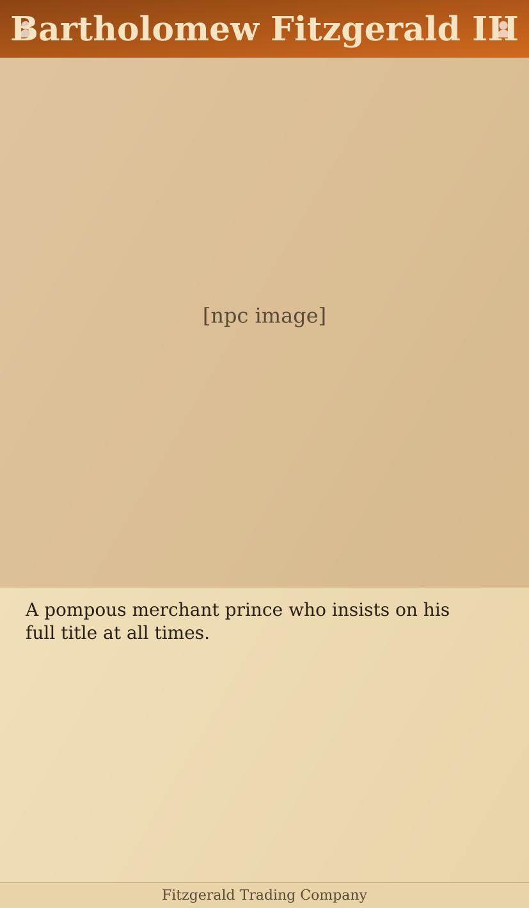
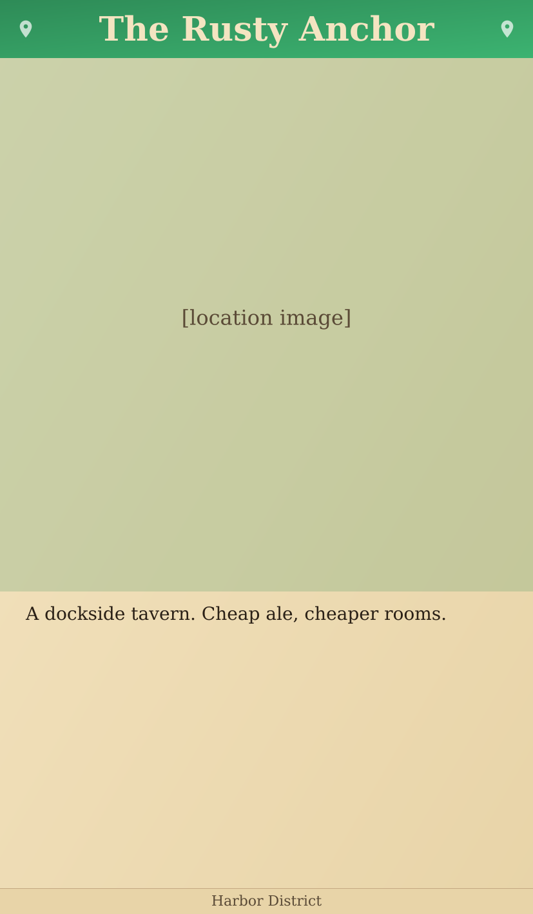
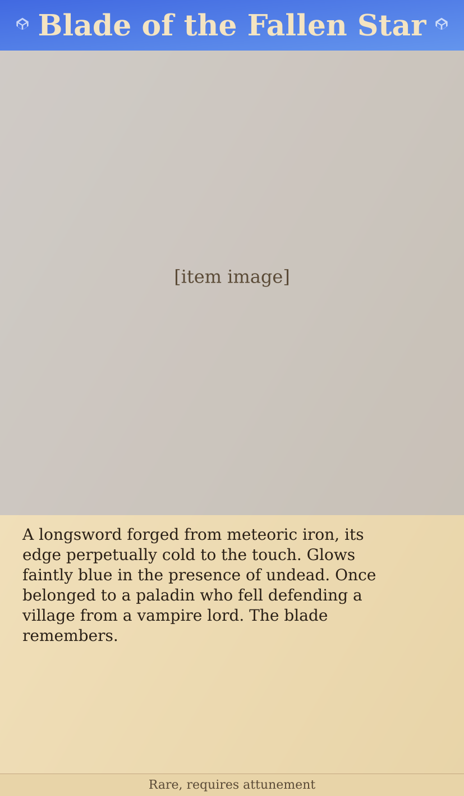

# Card Design Exploration Overview

This folder contains all exploration work for the card generator. Use this document to understand what was tested, what worked, and what was decided.

**Status:** Design in progress. See [Open Questions](#open-questions) for decisions still needed.

---

## Art Styles

Tested 8 art style prompts on the same subject (gnome inventor).

### Styles That Work

These produce **distinct, recognizable** artistic styles:

| Style | Portrait | On Card | Notes |
|-------|----------|---------|-------|
| **Ink Wash** |  |  | ✓ Best for whimsical campaigns. Has character and soul. **Currently selected.** |
| **Watercolor** |  |  | ✓ Softer, more painterly. Good alternative. |
| **Renaissance** |  |  | ✓ Distinct but serious/dramatic. Wrong tone for fun-heroes. |

### Styles That Collapse

These prompts produce **indistinguishable generic output** - avoid:

| Style | Portrait | Notes |
|-------|----------|-------|
| Classic D&D |  | ✗ Looks same as oil painting |
| Oil Painting |  | ✗ Generic, "devoid of soul" |
| Storybook |  | ✗ Indistinguishable from above |
| Digital Painterly |  | ✗ Generic AI look |
| Graphic Novel |  | ✗ Not actually graphic novel style |

**Finding:** Flux flattens vague style descriptors ("oil painting", "fantasy illustration") to the same generic output. Use specific technique descriptors ("ink drawing with watercolor wash, pen and ink linework").

---

## Card Sizes

### The Trade-off

Constraints in tension:
- User wants **≤5% crop** (15% is risky)
- User needs **6 lines of text** sometimes
- User wants **readable font** (not tiny)
- Standard card sizes fit standard sleeves

### Options Tested

| Option | Card Size | Image | Crop | Text Lines | Sample |
|--------|-----------|-------|------|------------|--------|
| A | Poker (750×1050) | Square | 5% | 5 lines |  |
| B | Poker | Square | 7.5% | 6 lines |  |
| C | Poker | Square | 5% | 6 lines (small font) |  |
| D | Tarot (827×1417) | Square | 0% | 11 lines |  |

### Decision: Tarot Size

**Rationale:**
- User prints at home, cuts with scissors, has no existing sleeves
- Tarot sleeves (70×120mm) are purchasable
- Zero crop, readable font, plenty of text space
- No downside since sleeve constraint doesn't exist yet

**Final sample:** 

---

## Content Variation Tests

Tested tarot layout with varied content lengths.

| Test Case | Category | Chars | Lines | Result |
|-----------|----------|-------|-------|--------|
| Short description | NPC | 36 | 1/11 |  |
| Medium description | NPC | 205 | 5/11 |  |
| Long description | NPC | 416 | 10/11 |  |
| Long name | NPC | 69 | 2/11 |  |
| Location short | Location | 44 | 1/11 |  |
| Location long | Location | 392 | 9/11 |  |
| Item medium | Item | 222 | 6/11 |  |

**Finding:** All test cases fit. Short descriptions leave empty space (see [Open Questions](#open-questions)).

---

## Current Layout Specification

```
┌─────────────────────────────┐
│  HEADER (90px)              │  Category gradient + title + icons
│  52px serif title           │
├─────────────────────────────┤
│                             │
│                             │
│  PORTRAIT (827px)           │  Square image, 0% crop
│                             │
│                             │
│                             │
├─────────────────────────────┤
│  BODY (460px)               │  28px serif, 36px line height
│  ~11 lines of text          │  Left-aligned, 40px padding
│                             │
├─────────────────────────────┤
│  FOOTER (40px)              │  22px serif, centered
└─────────────────────────────┘

Card size: 827×1417px (70×120mm at 300dpi)
Background: Parchment gradient
```

---

## Open Questions

Decisions still needed from user:

### 1. Per-Category Layouts
Same layout for NPCs, locations, items, factions? Or category-specific variants?

### 2. Snapshot vs Living
Cards frozen at creation? Or updatable over time?

### 3. Primary Use Case
Table handout? GM reference? Player collection? Affects information density.

### 4. Short Descriptions
Cards with 1-2 lines leave empty space. Accept it? Add more content types? Dynamic layout?

### 5. Long Names
Names exceeding header width: truncate? shrink font? wrap? max length?

---

## File Index

### Portraits (style exploration)
- `style-ink-wash.png` - ✓ Selected
- `style-watercolor.png` - ✓ Good alternative
- `style-renaissance.png` - ✓ For serious campaigns
- `style-classic-dnd.png` - ✗ Generic
- `style-oil-painting.png` - ✗ Generic
- `style-storybook.png` - ✗ Generic
- `style-digital-painterly.png` - ✗ Generic
- `style-graphic-novel.png` - ✗ Generic

### Complete Cards (style on card)
- `card-ink-wash.png`, `card-watercolor.png`, `card-renaissance.png`, etc.

### Size Comparisons
- `tradeoff-A-*.png` through `tradeoff-D-*.png` - Size/crop/text trade-offs

### Content Tests
- `test-npc-short.png` through `test-item-medium.png` - Varied content lengths

### Final Sample
- `card-tarot-inkwash.png` - Current best output
- `portrait.png` - Source portrait for tarot sample
