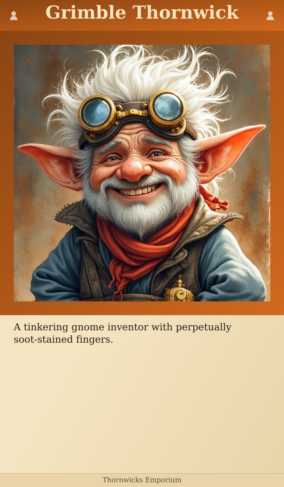
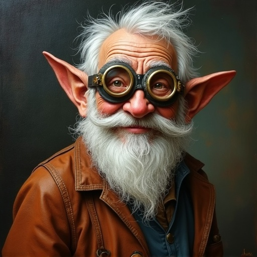
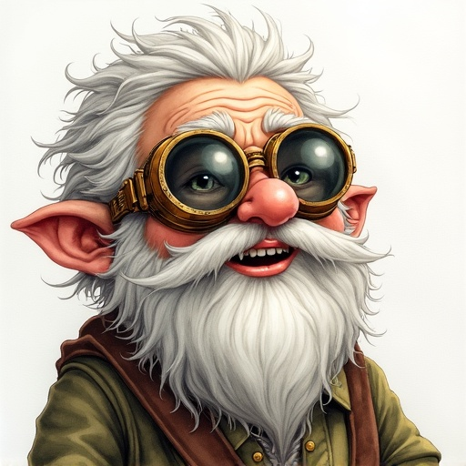
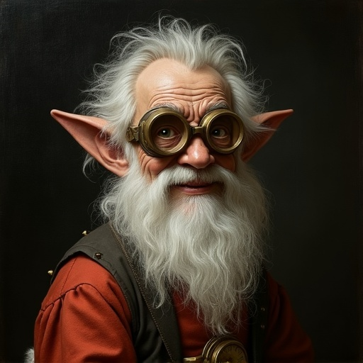

# Card Design Overview

Final design specification for the card generator. All decisions resolved.

---

## Final Layout



```
┌─────────────────────────────┐
│  HEADER (90px)              │  Category gradient + title + icons
│  52px serif title           │
├─────────────────────────────┤
│ ┌─────────────────────────┐ │
│ │                         │ │  40px category-colored border
│ │  PORTRAIT (747×747px)   │ │  (MTG-style framing)
│ │                         │ │  Aids cutting + category recognition
│ └─────────────────────────┘ │
├─────────────────────────────┤
│  BODY (460px)               │  28px serif, 36px line height
│  ~11 lines of text          │  Left-aligned, 40px padding
│                             │
├─────────────────────────────┤
│  FOOTER (40px)              │  22px serif, centered
└─────────────────────────────┘

Card size: 827×1417px (70×120mm at 300dpi) - fits tarot sleeves
Background: Parchment gradient
Portrait border: 40px category color
```

---

## Key Decisions

### Card Size: Tarot (70×120mm)

**Why:** Zero crop, readable font, 11 lines of text. User prints at home with scissors, no existing sleeve constraint. Tarot sleeves purchasable if needed.

### Portrait Border: 40px Category Color

**Why:** Follows MTG design convention.
- Cutting guide for scissors
- Category recognition (colored frame = card type)
- Visual framing (intentional, not edge-bleed accident)

### Art Style: Ink Wash

**Why:** Produces distinct, recognizable output. User selected for whimsical "fun-heroes" campaign tone.

**Prompt pattern:** `ink drawing with watercolor wash, pen and ink linework`

**Avoid:** Vague descriptors like "oil painting", "fantasy illustration" - Flux flattens these to generic output.

### Same Layout for All Categories

**Why:** KISS, YAGNI. Categories distinguished by header color, not layout.

### Font Sizing

- Title: 52px, shrinks dynamically for long names, wraps to 2 lines if needed
- Body: 28px for 1-6 lines, 24px for 7+ lines
- Footer: 22px

---

## Art Style Reference

Tested 8 styles. Results:

| Works | Doesn't Work |
|-------|--------------|
|  Ink wash ✓ |  Oil painting ✗ |
|  Watercolor ✓ |  Classic D&D ✗ |
|  Graphic novel ✓ |  Storybook ✗ |
|  Renaissance ✓ |  Digital ✗ |

**Finding:** Specific technique descriptors work. Vague aesthetic descriptors collapse to generic AI output.

---

## Card Lifecycle

1. Batch generate portraits via fal.ai
2. Select best one
3. Render card with `render-card-sharp.js`
4. Keep canonical version in HEAD
5. Rejected/obsolete versions live in git history only

Campaign documents are source of truth. Cards are reminders, not revelations.

---

## Files

- `card-final.png` - Current layout example
- `portrait.png` - Source portrait for examples
- `style-*.png` - Art style exploration (reference)
