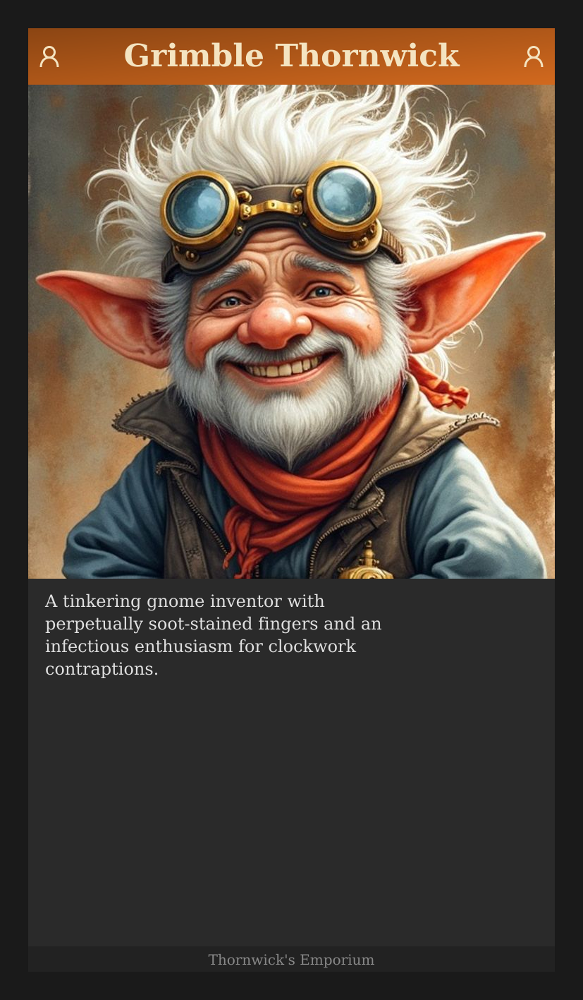
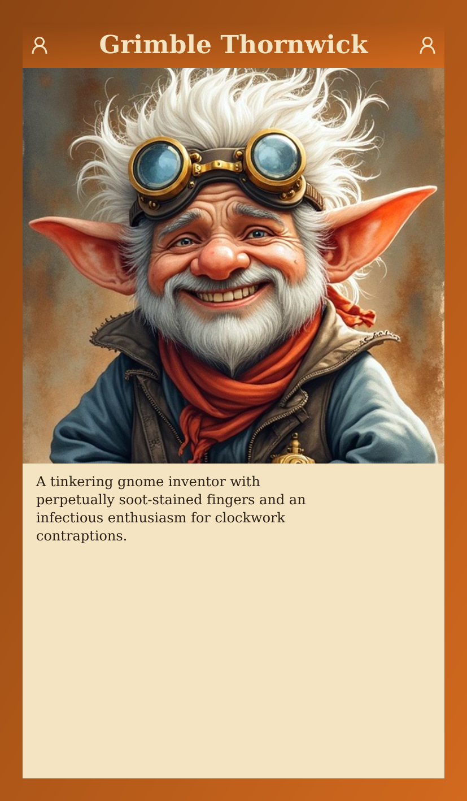
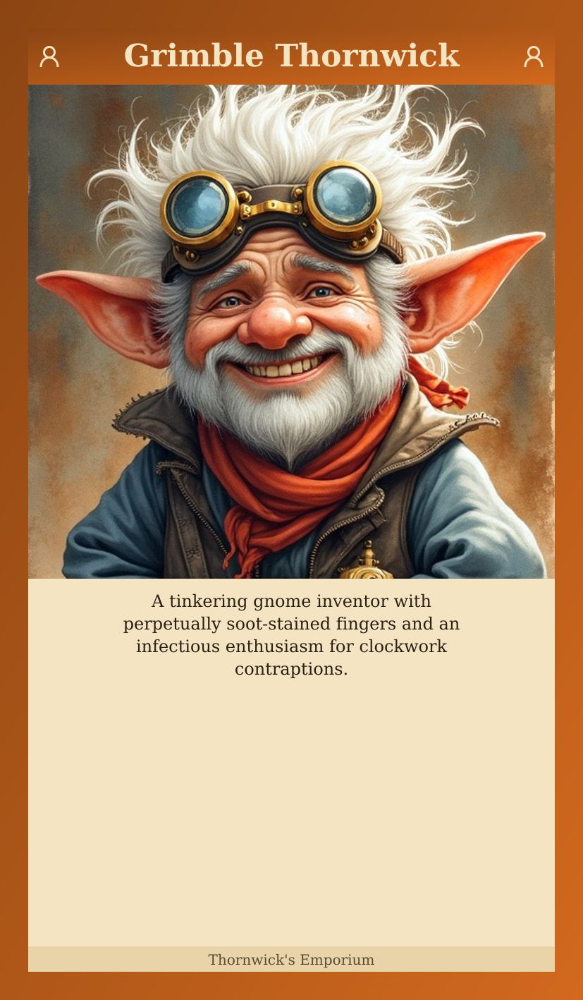
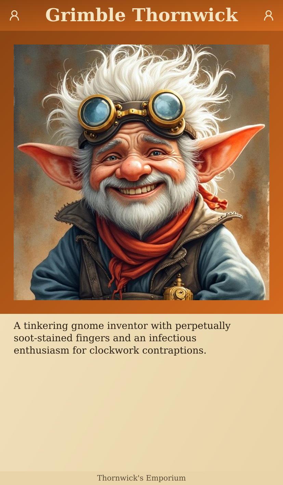

# Layout Variant Comparison

New default: **Full frame** with 40px border and icons.

**Feedback needed:** Which elements work best? Any combinations to try?

---

## New Default

| Full frame (NEW DEFAULT) |
|:---:|
|  |

---

## Border Width

| 40px (default) | 20px |
|:---:|:---:|
|  |  |

---

## Text Box Background

| Parchment (default) | Tinted | Solid color |
|:---:|:---:|:---:|
|  |  |  |

---

## Portrait Size

| Default (700px) | Larger (800px) |
|:---:|:---:|
|  |  |

---

## Header Variations

| With icons (default) | No icons | Larger header |
|:---:|:---:|:---:|
|  |  |  |

---

## Decorative Elements

| Default | With divider line |
|:---:|:---:|
|  |  |

---

## Theme

| Light (default) | Dark |
|:---:|:---:|
|  |  |

---

## Footer Variations

| Default | No footer | Overlaid on portrait |
|:---:|:---:|:---:|
|  |  |  |

---

## Typography

| Serif (default) | Sans-serif | Centered | Italic |
|:---:|:---:|:---:|:---:|
|  |  |  |  |

---

## Full Frame vs Portrait Frame

| Full frame (NEW) | Portrait frame only (OLD) |
|:---:|:---:|
|  |  |

---
