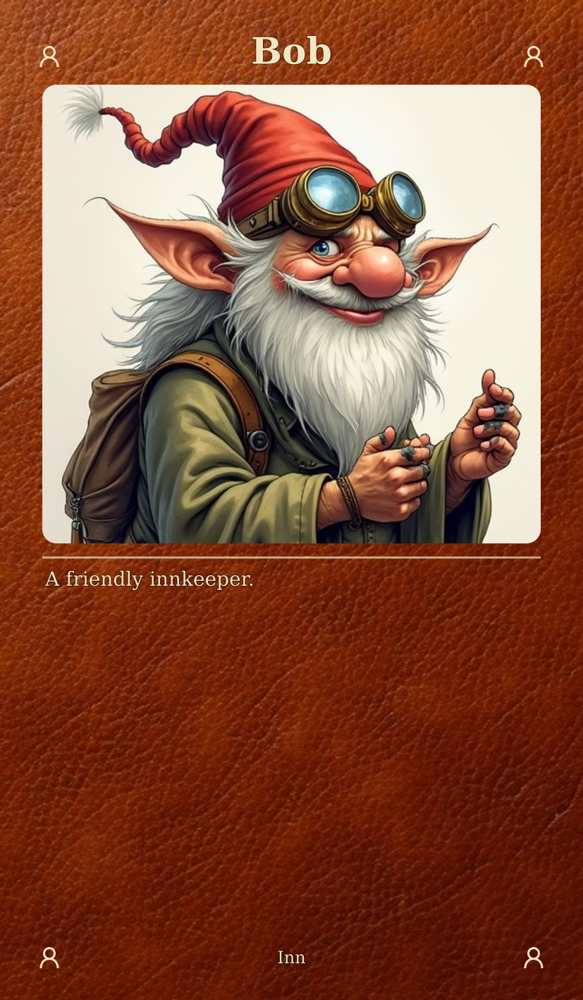
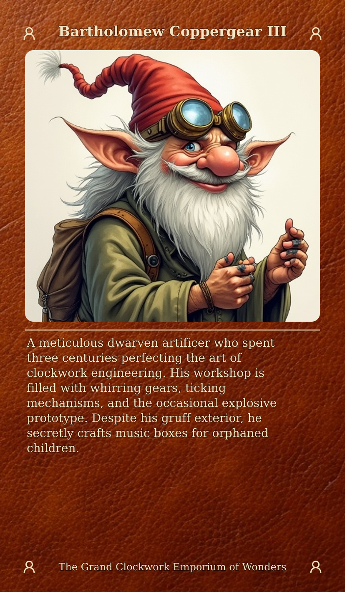
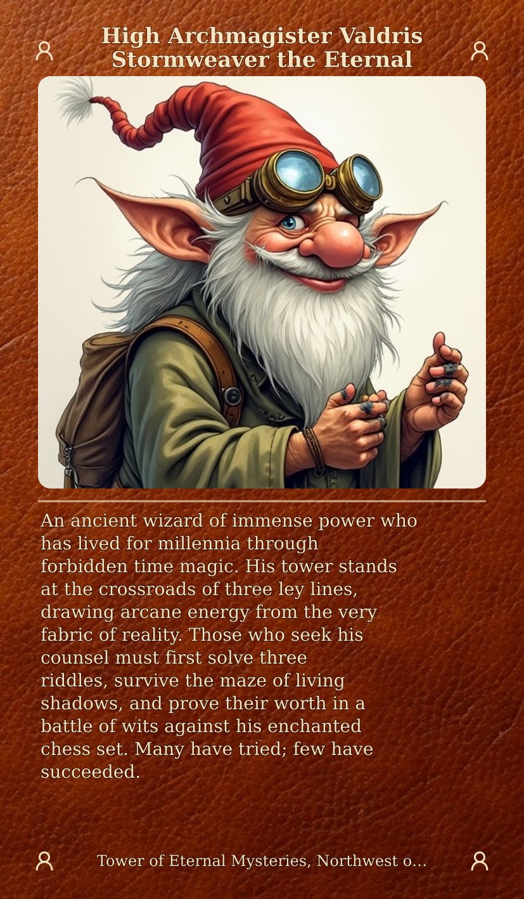
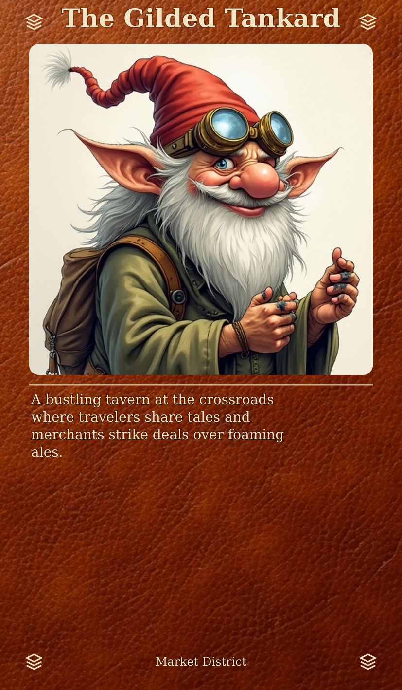
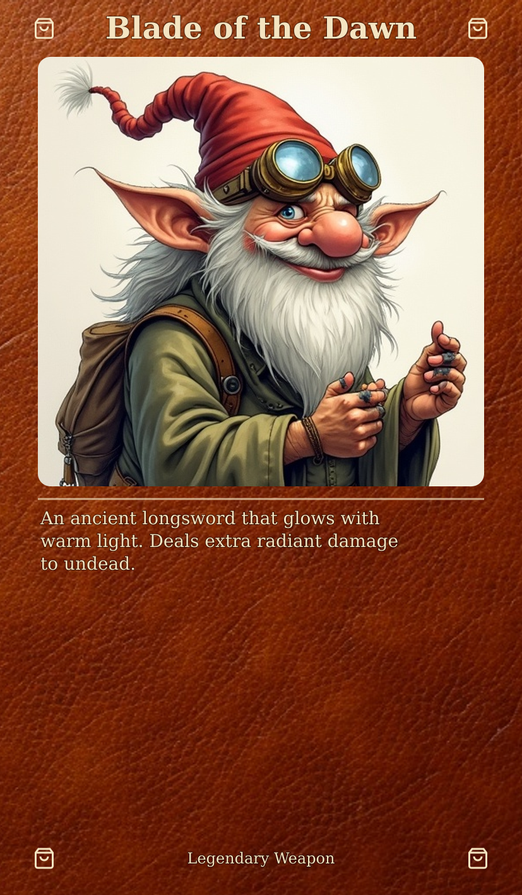

# Layout Variant Comparison

## Current Default

**Settings**: Texture background, no tint, rounded portrait, icons in footer corners.

| CURRENT DEFAULT (18-tex-corner-icons) |
|:---:|
|  |

---

## Alternative Settings

### Text Area Tinting

| No tint (CURRENT) | Dark tint | Leather tint |
|:---:|:---:|:---:|
|  |  |  |

### Footer Decoration

| Icons (CURRENT) | Decorative corners | None |
|:---:|:---:|:---:|
|  |  |  |

### Portrait Styling

| Rounded (CURRENT) | Square | Rounded + border |
|:---:|:---:|:---:|
|  |  |  |

### Text Area Borders

| None (CURRENT) | Line border | Decorative corners |
|:---:|:---:|:---:|
|  |  |  |

---

## Legacy Variants (Gradient Background)

These use a solid color gradient instead of texture background.

| Gradient default | Parchment text box | No icons |
|:---:|:---:|:---:|
|  |  |  |

---

## Edge Case Tests

### Text Length Handling

| Short text | Medium text |
|:---:|:---:|
|  |  |

| Long text | Very long text |
|:---:|:---:|
|  |  |

### Category Variants (different icons)

| Location | Item | Faction |
|:---:|:---:|:---:|
|  |  |  |

---
