# Layout Variant Comparison

New default: **Full frame**, 40px border, 90px header, solid color, icons, **divider line**.

---

## New Default

| Solid color (NEW DEFAULT) |
|:---:|
|  |

---

## Text Box Background

| Solid (default) | Parchment (old) |
|:---:|:---:|
|  | 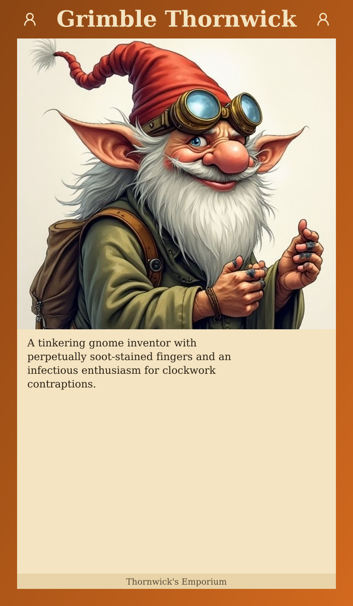 |

---

## Header Icons

| With icons (default) | No icons |
|:---:|:---:|
|  | 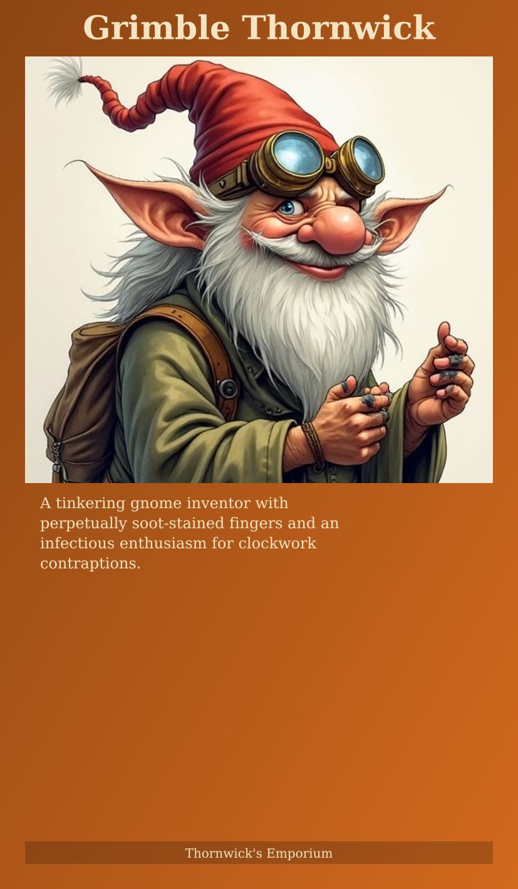 |

---

## Decorative Elements

| With divider (default) | Without divider |
|:---:|:---:|
|  |  |

---

## Typography

**Serif (default)**

**Sans-serif**

**Centered**
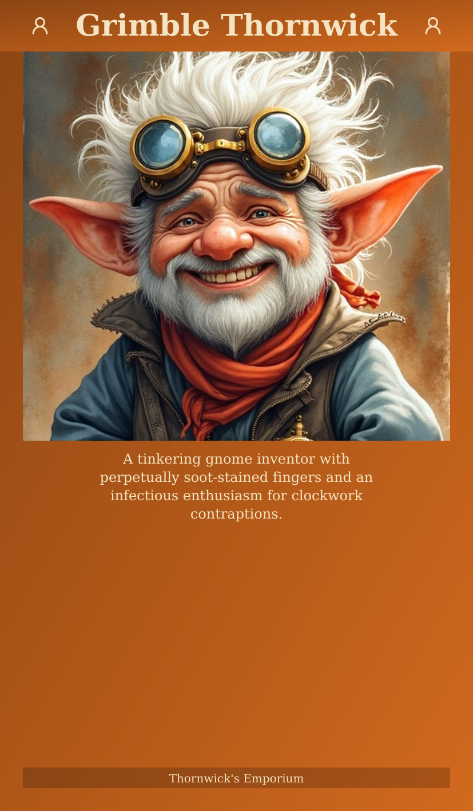

**Italic**
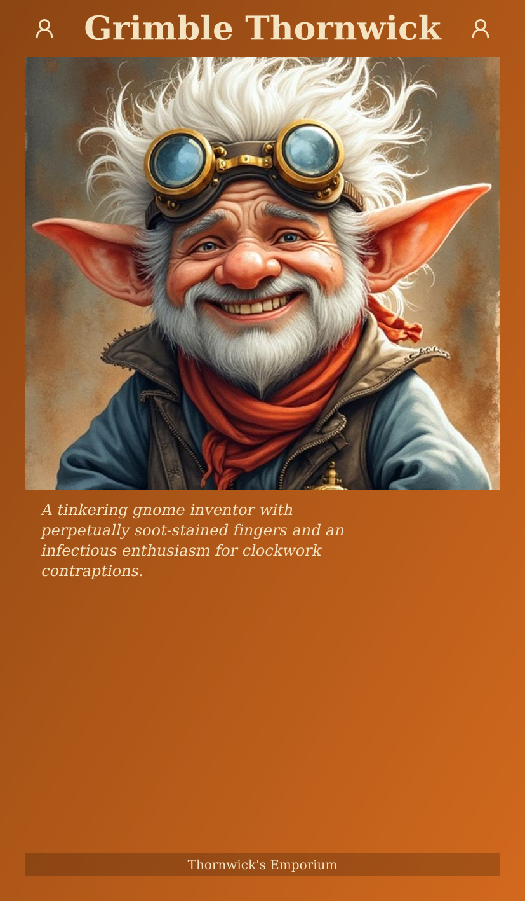

---

## Texture Background Variants

Generate texture: `node scripts/generate-texture.js texture.png --category=npc --api`

### Text Area Tinting

| Dark tint (current) | Leather tint | No tint |
|:---:|:---:|:---:|
| 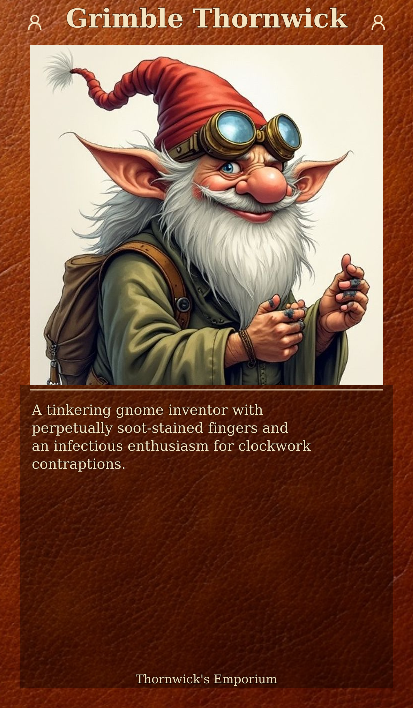 | 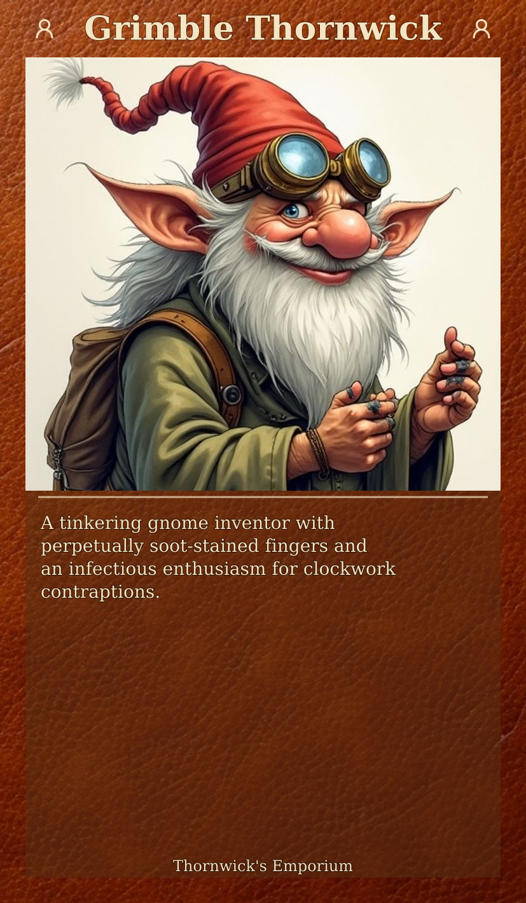 | 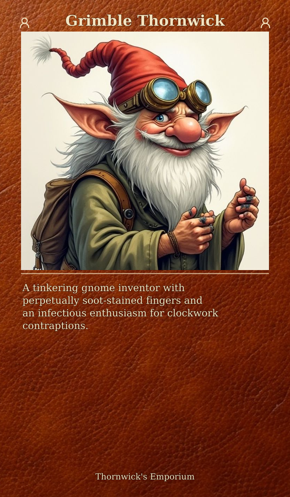 |

### Text Area Borders

| Line border | Decorative corners |
|:---:|:---:|
| 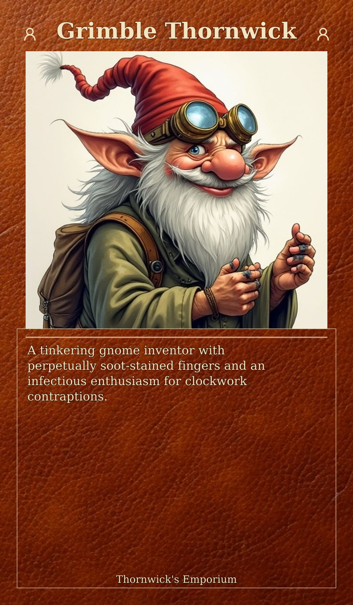 |  |

### Portrait Styling

| Rounded corners | Border line | Rounded + border |
|:---:|:---:|:---:|
| 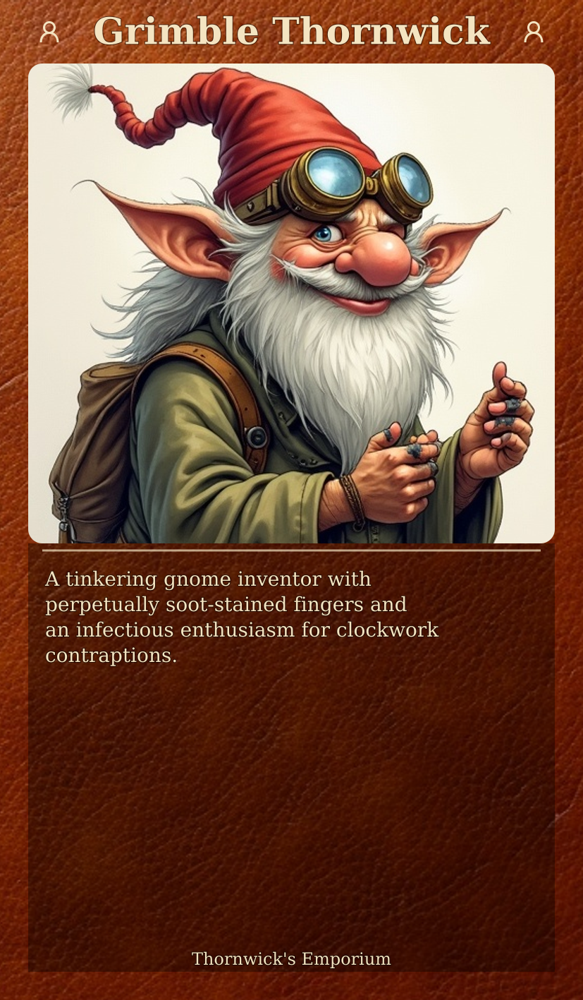 |  | 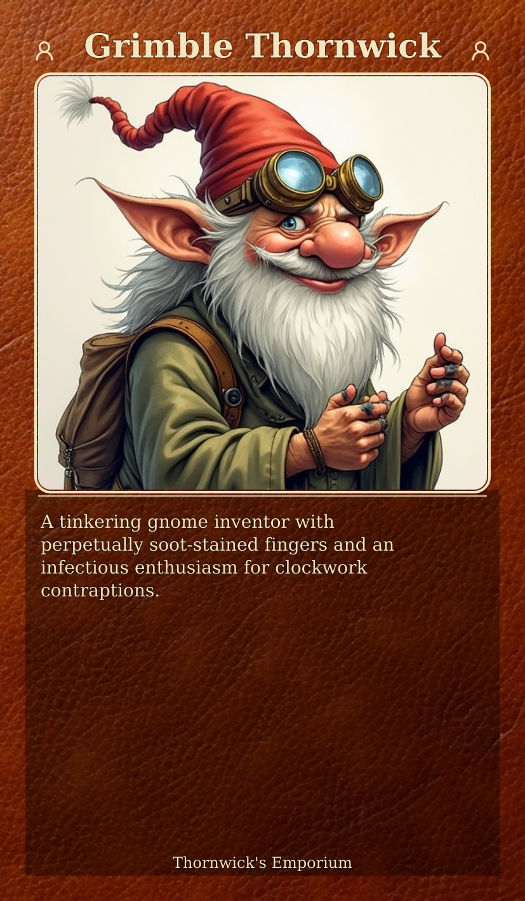 |

### Text Area Decoration

| Decorative corners | Icons in corners |
|:---:|:---:|
|  | 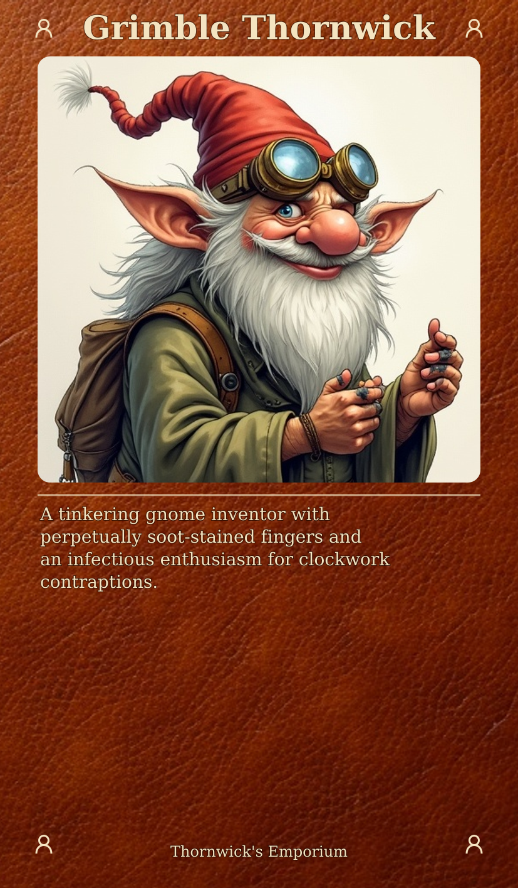 |

---
