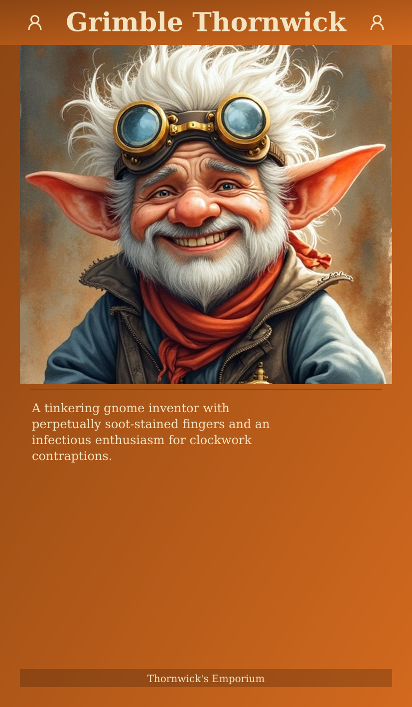

# Layout Variant Comparison

New default: **Full frame**, 40px border, 90px header, solid color, icons, divider line.

---

## New Default

| Solid color (NEW DEFAULT) |
|:---:|
|  |

---

## Text Box Background

| Solid (default) | Parchment (old) |
|:---:|:---:|
|  |  |

---

## Header Icons

| With icons (default) | No icons |
|:---:|:---:|
|  |  |

---

## Decorative Elements

| Default | With divider line |
|:---:|:---:|
|  |  |

---

## Typography

| Serif (default) | Sans-serif | Centered | Italic |
|:---:|:---:|:---:|:---:|
|  |  |  |  |

---
