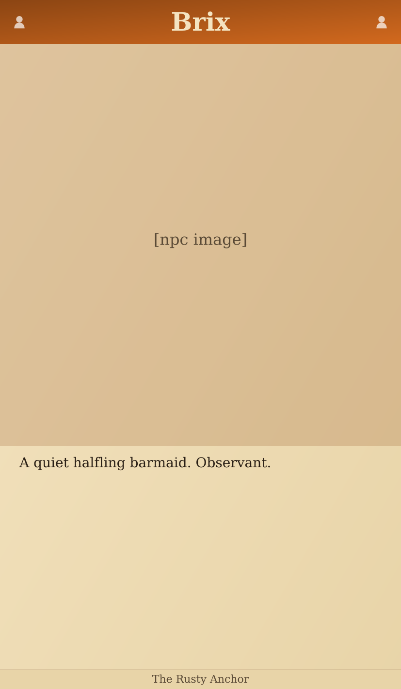
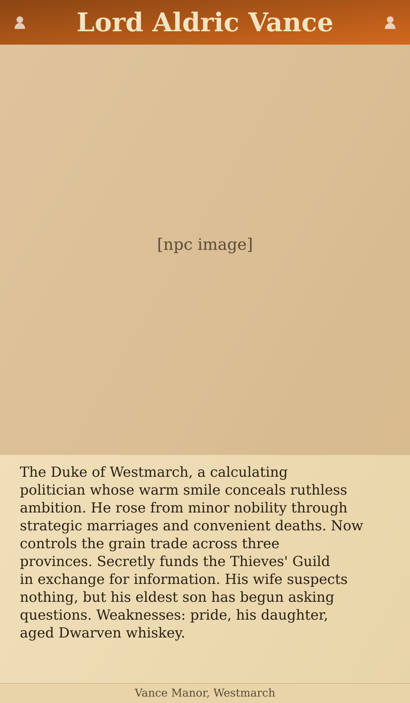

# Layout Test Results

Testing tarot layout (827×1417px) with varied content.

**Layout specs:**
- Header: 90px
- Portrait: 827px
- Body: 460px (11 lines max)
- Footer: 40px

## Test Results

| Test | Category | Chars | Lines Used | Status |
|------|----------|-------|------------|--------|
| npc-short | npc | 36 | 1/11 | ✓ |
| npc-medium | npc | 205 | 5/11 | ✓ |
| npc-long | npc | 416 | 10/11 | ✓ |
| location-short | location | 44 | 1/11 | ✓ |
| location-long | location | 392 | 9/11 | ✓ |
| item-medium | item | 222 | 6/11 | ✓ |
| npc-long-name | npc | 69 | 2/11 | ✓ |

## Sample Cards

### Brix (npc-short)

### Grimble Thornwick (npc-medium)

### Lord Aldric Vance (npc-long)

### The Rusty Anchor (location-short)

### The Whispering Archives (location-long)

### Blade of the Fallen Star (item-medium)

### Bartholomew Fitzgerald III (npc-long-name)

