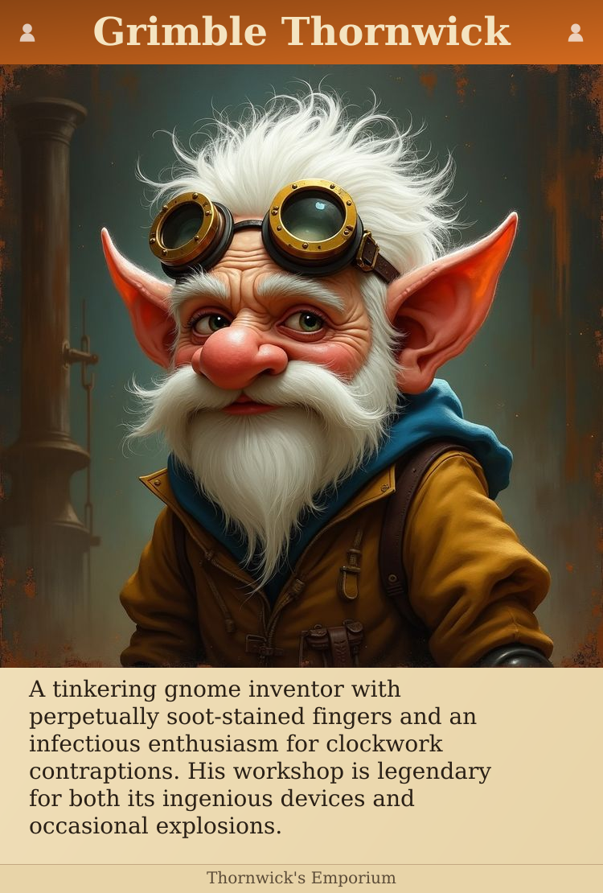
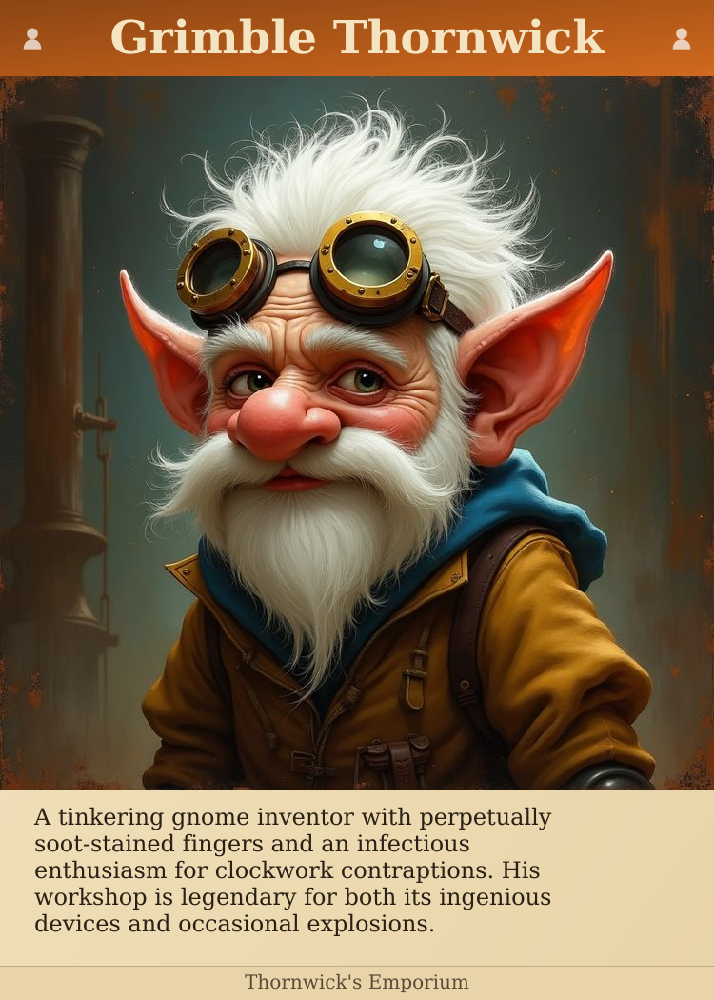
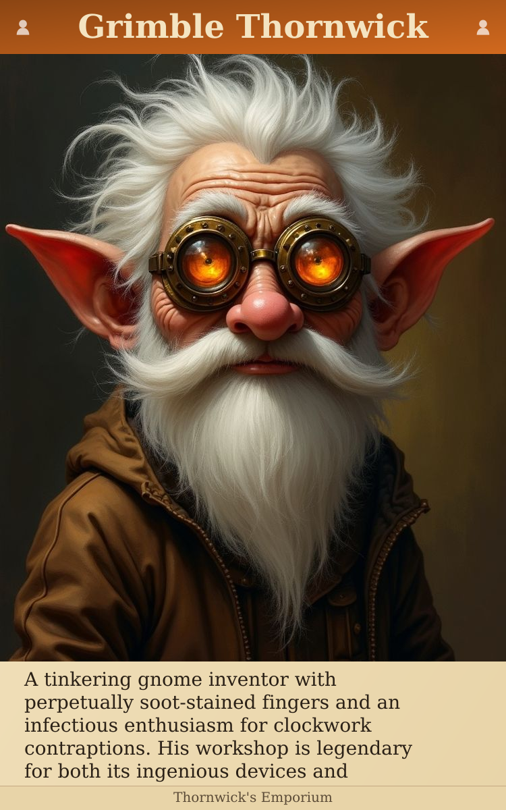
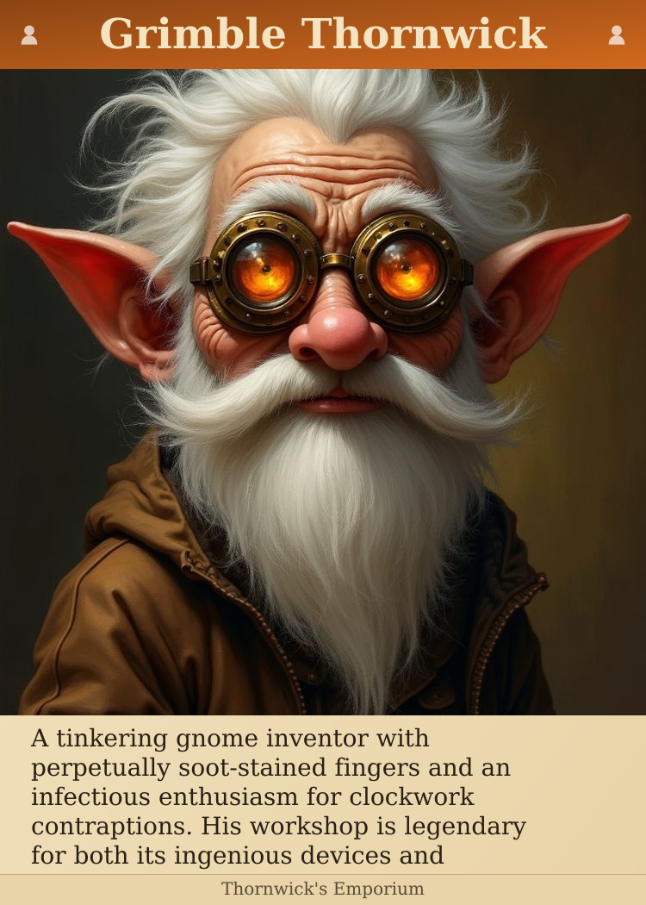

# Card Design Comparison

All options show the same content. Goal: 6 lines of text, ≤5% crop ideal.

| Option | Card Size | Image | Crop | Text Lines |
|--------|-----------|-------|------|------------|
| Square image | 750×1110 | Square | 0.0% | 6 |
| Square image | 750×1050 | Square | 0.0% | 5 |
| 4:3 image | 750×1200 | 4:3 | 10.0% | 4 |
| 4:3 image | 750×1050 | 4:3 | 25.0% | 4 |
| 4:3 image | 750×1050 | 4:3 | 25.0% | 4 |

---

## Square image + Tall card (6 lines)

- **Card:** 750×1110px
- **Portrait area:** 750px (image scales to 750px)
- **Crop:** 0.0% (0px removed)
- **Text space:** 244px = 6 lines
- **Font:** 28px / 34px line height

---

## Square image + Poker + Smaller text (6 lines)

- **Card:** 750×1050px
- **Portrait area:** 750px (image scales to 750px)
- **Crop:** 0.0% (0px removed)
- **Text space:** 184px = 5 lines
- **Font:** 24px / 28px line height

---

## 4:3 image + Tall card (~10% crop)

- **Card:** 750×1200px
- **Portrait area:** 900px (image scales to 1000px)
- **Crop:** 10.0% (100px removed)
- **Text space:** 184px = 4 lines
- **Font:** 28px / 34px line height

---

## 4:3 image + Poker (25% crop)

- **Card:** 750×1050px
- **Portrait area:** 750px (image scales to 1000px)
- **Crop:** 25.0% (250px removed)
- **Text space:** 184px = 4 lines
- **Font:** 28px / 34px line height

---

## 4:3 image + Poker + Top crop (keep head)

- **Card:** 750×1050px
- **Portrait area:** 750px (image scales to 1000px)
- **Crop:** 25.0% (250px removed)
- **Text space:** 184px = 4 lines
- **Font:** 28px / 34px line height

---

## Your Feedback

Which option do you prefer? Note any issues:

- Option 1:
- Option 2:
- Option 3:
- Option 4:
- Option 5:
