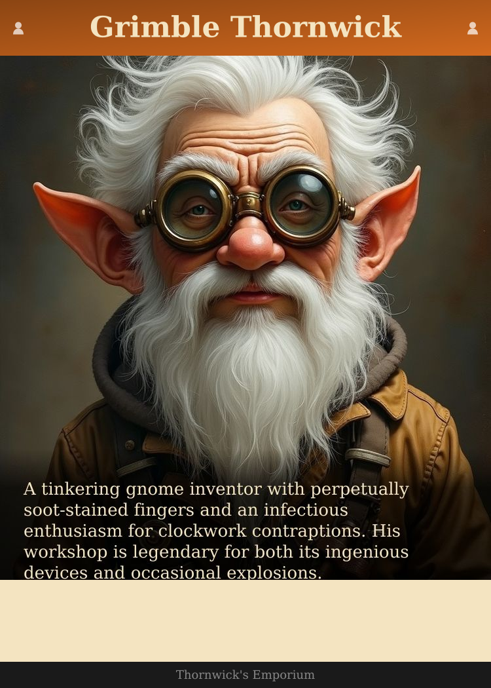
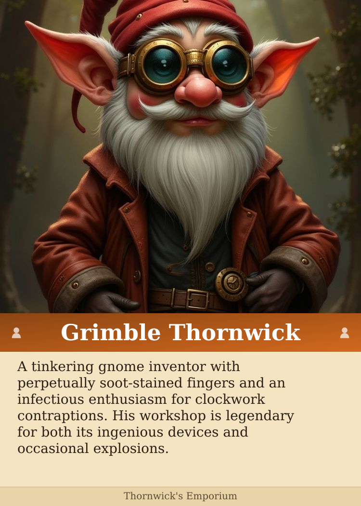
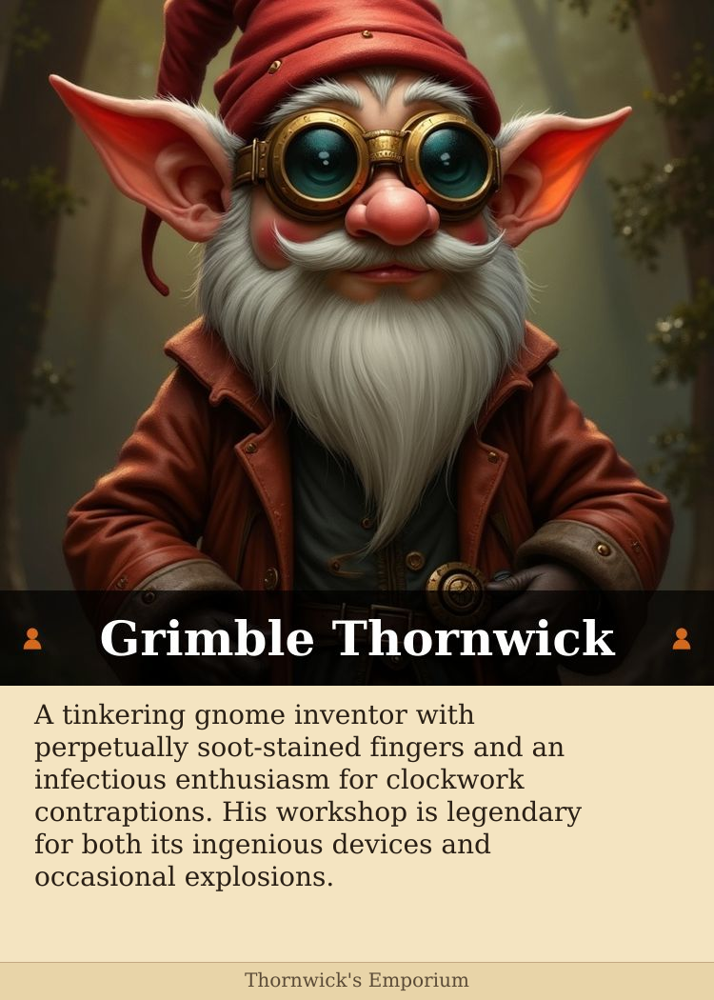
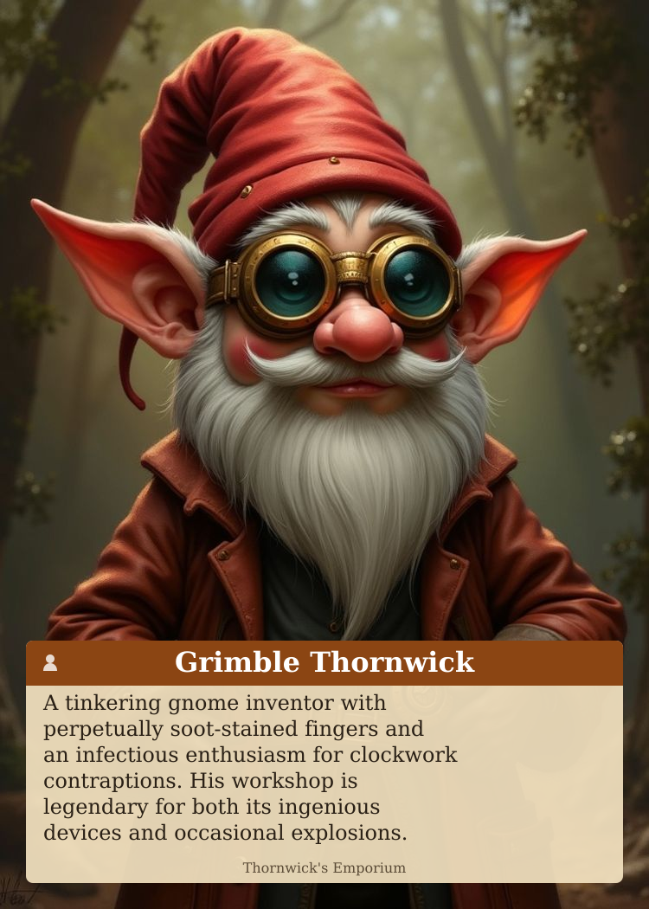

# Card Layout Exploration

Same content (Grimble Thornwick), 6 different layouts. Scroll through and note what you like/dislike.

---

## Layout A: Current Design
**Structure:** Header band → Portrait → Text area → Footer


**What it does:**
- Colored header band with name + category icons
- Portrait below header (620px)
- Text on parchment background
- Clear visual hierarchy: name → face → info

---

## Layout B: Text Overlay with Gradient
**Structure:** Header band → Large portrait with text overlaid at bottom



**What it does:**
- Larger portrait (800px) dominates the card
- Description text overlaid on portrait with dark gradient fade
- More immersive/cinematic feel
- Text might be harder to read depending on portrait colors

---

## Layout C: Portrait First
**Structure:** Portrait at top → Name band → Text → Footer



**What it does:**
- Portrait is first thing you see (no header above it)
- Name band separates image from description
- Portrait gets full attention at top
- When flipping through cards, faces appear first

---

## Layout D: Name Overlay on Portrait
**Structure:** Portrait with name overlaid at bottom → Text → Footer



**What it does:**
- Name appears on semi-transparent bar over portrait
- Portrait extends to top edge
- Similar to Layout C but name is integrated with image
- More vertical space for portrait

---

## Layout E: Minimal
**Structure:** Thin accent line → Portrait → Name (no band) → Text → Footer


**What it does:**
- Very thin colored accent line instead of header band
- Name is just text on parchment (no colored background)
- Cleaner, more understated
- Category icons in accent color beside name
- Less visual "weight" at top

---

## Layout F: Full Bleed with Floating Box
**Structure:** Full-card portrait with floating text box overlay



**What it does:**
- Portrait covers entire card
- All text in a floating semi-transparent box
- Most immersive - portrait is the star
- Text box has rounded corners
- Name integrated into box header

---

## Quick Comparison

| Layout | Portrait Size | Name Position | Text Position | Feel |
|--------|---------------|---------------|---------------|------|
| A | 620px | Top band | Below portrait | Traditional card |
| B | 800px | Top band | Overlaid on portrait | Cinematic |
| C | 650px | Below portrait | Below name | Face-first |
| D | 720px | Overlaid bottom | Below portrait | Integrated |
| E | 640px | Below portrait (no band) | Below name | Minimal/clean |
| F | Full | In floating box | In floating box | Immersive |

---

## Feedback Template

```
Layout A:
Layout B:
Layout C:
Layout D:
Layout E:
Layout F:

Overall preference:
Notes:
```
