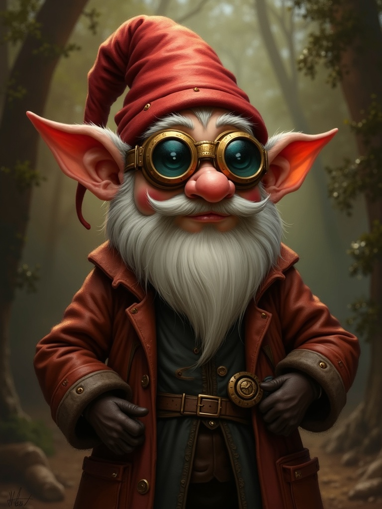
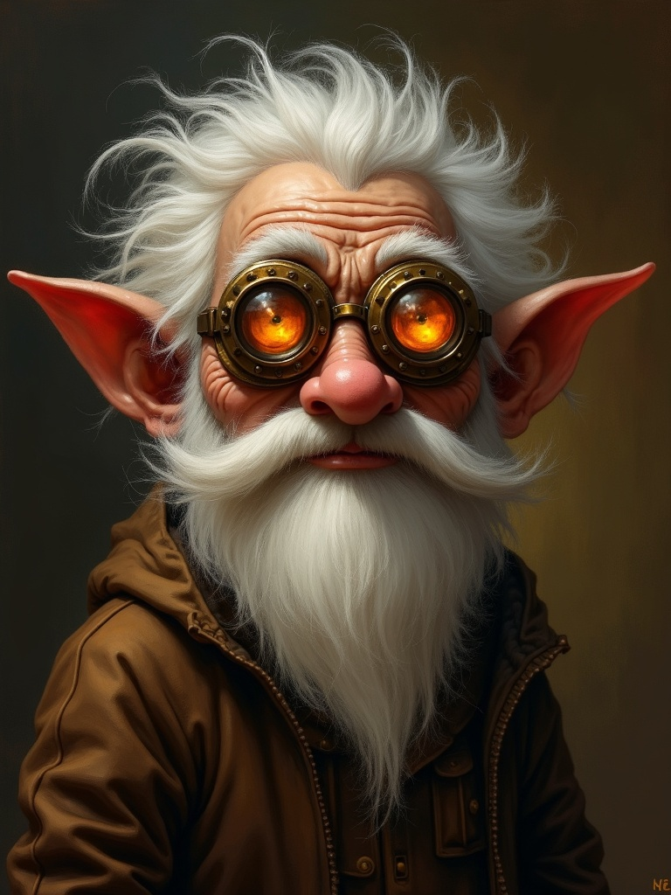

# Card Design Decisions

Three independent decisions to make. Each section isolates ONE variable.

---

## Decision 1: Image Aspect Ratio

Same prompt, different aspect ratios. Which portrait style do you prefer?

### 1A: Square (1:1)

- Dimensions: 1024×1024
- Character framing: head + upper torso
- Typical for: icon-style portraits

### 1B: Portrait 4:3

- Dimensions: 768×1024
- Character framing: head + more body context
- Typical for: character art, book illustrations

**Your preference: 1A / 1B / either is fine**

---

## Decision 2: Card Size (if using 4:3 images)

If you prefer 4:3 images, the poker card size requires cropping OR we change card size.

### 2A: Poker size (750×1050) + 35% crop

- Standard card size, prints easily
- Crops top/bottom of image
- Room for 7 lines of text

### 2B: Tall card (750×1200) + 10% crop

- Non-standard size (may need custom printing)
- Keeps most of image
- Room for only 4 lines of text

**Your preference: 2A / 2B / need to see more options**

---

## Decision 3: Crop Position (if cropping)

If cropping is acceptable, where should we crop from?

### 3A: Center crop

- Crops equally from top and bottom
- May cut off hair/hat AND feet

### 3B: Top-weighted crop

- Keeps top of image (head)
- Cuts more from bottom (body)

**Your preference: 3A / 3B / depends on image**

---

## Decision 4: Text Space

How much description text do you typically need?

### 4A: Short descriptions (~100 chars, 4-5 lines)
Example: "A tinkering gnome inventor with perpetually soot-stained fingers and an infectious enthusiasm for clockwork."

### 4B: Medium descriptions (~150 chars, 6-7 lines)
Example: "A tinkering gnome inventor with perpetually soot-stained fingers and an infectious enthusiasm for clockwork contraptions. His workshop is legendary for both its ingenious devices and occasional explosions."

**Your preference: 4A / 4B**

---

## Summary

Please respond with your choices, e.g.:
- "1B, 2A, 3B, 4B"
- Or notes like "1B but the 4:3 portrait looks weird, try different prompt"
