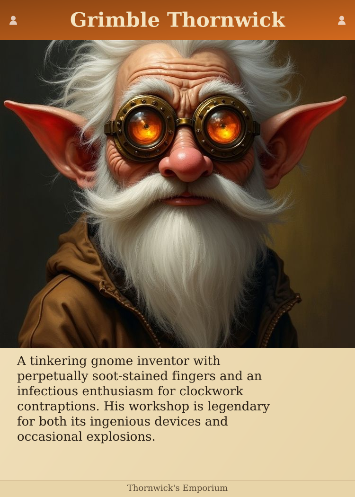
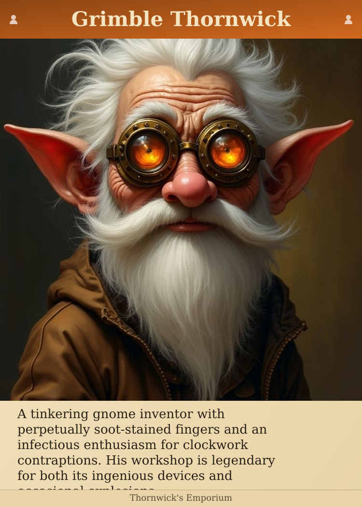

# Card Size Exploration

Same content, different card sizes and image aspect ratios.

## Poker (750×1050) + Square image

- Card: 750×1050px
- Portrait area: 750px
- Image crop: **0.0%** (0px removed)
- Text space: 184px (~4 lines)

---

## Poker (750×1050) + 4:3 image, center crop

- Card: 750×1050px
- Portrait area: 650px
- Image crop: **35.0%** (350px removed)
- Text space: 279px (~7 lines)

---

## Poker (750×1050) + 4:3 image, top crop (keep face)

- Card: 750×1050px
- Portrait area: 650px
- Image crop: **35.0%** (350px removed)
- Text space: 279px (~7 lines)

---

## Tall card (750×1200) + 4:3 image, minimal crop

- Card: 750×1200px
- Portrait area: 900px
- Image crop: **10.0%** (100px removed)
- Text space: 179px (~4 lines)

---

## Poker (750×1050) + 4:3 full height, crop sides

- Card: 750×1050px
- Portrait area: 750px
- Image crop: **25.0%** (250px removed)
- Text space: 184px (~4 lines)

