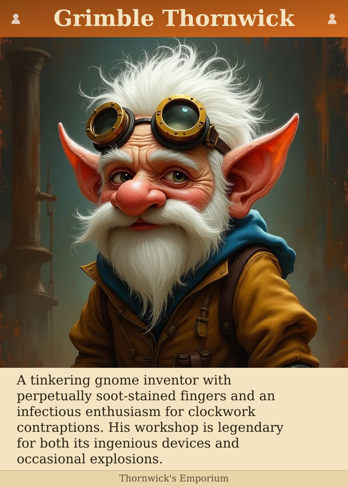
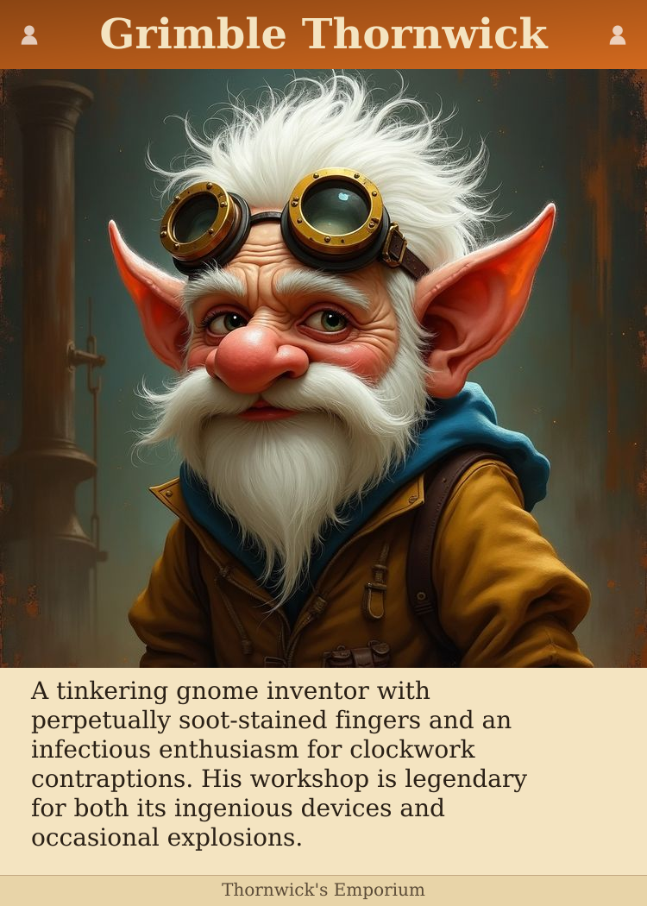
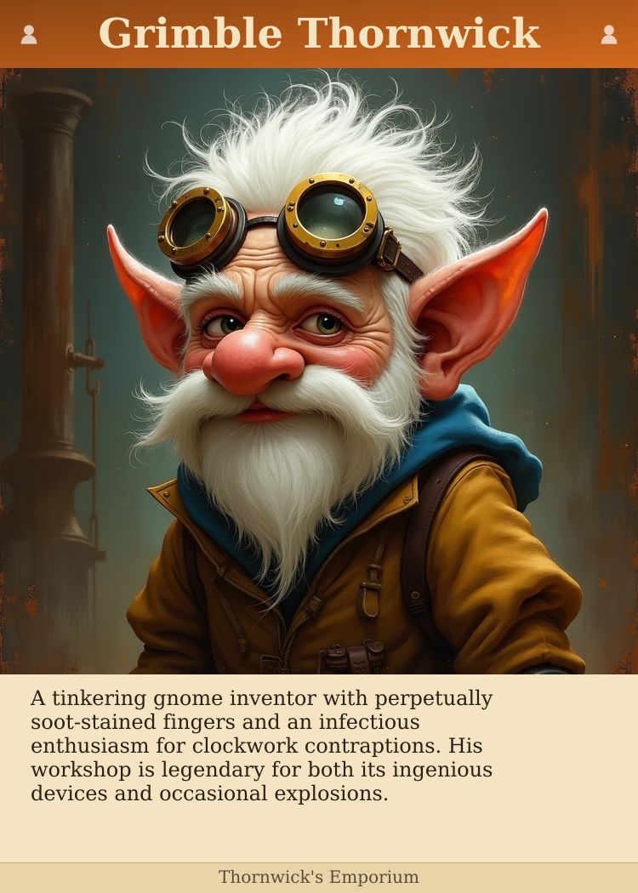
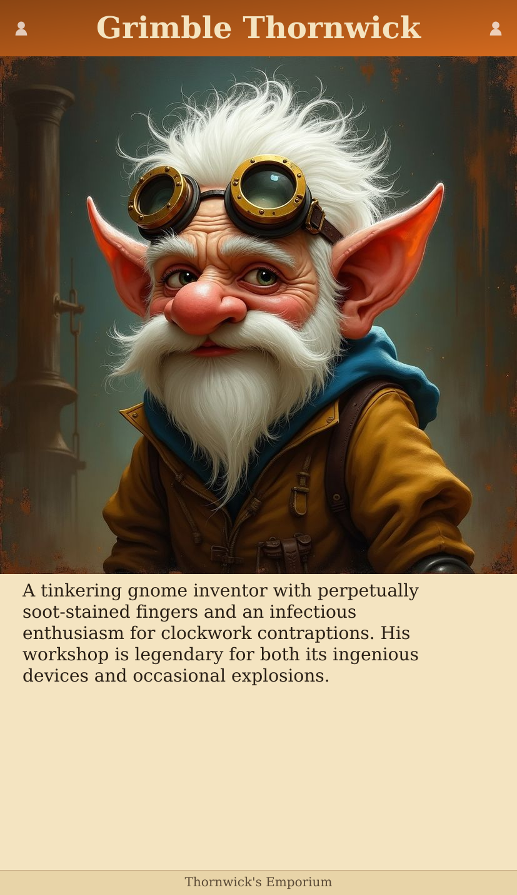

# Card Size/Crop Trade-offs

Same content, same image. Which trade-off do you prefer?

| Option | Card | Crop | Lines | Text Size |
|--------|------|------|-------|-----------|
| Poker, 5% crop, 5 lines | 750×1050 | 4.9% | 5 | 28px |
| Poker, 7.5% crop, 6 lines | 750×1050 | 7.5% | 6 | 28px |
| Poker, 5% crop, 6 lines (smaller text) | 750×1050 | 4.9% | 6 | 24px |
| Tarot, minimal crop, 8+ lines | 827×1430 | 0.0% | 12 | 28px |

---

## Poker, 5% crop, 5 lines

- Card: 750×1050px
- Portrait: 713px, Crop: 4.9%
- Body: 221px = 5 lines @ 28px

---

## Poker, 7.5% crop, 6 lines

- Card: 750×1050px
- Portrait: 694px, Crop: 7.5%
- Body: 240px = 6 lines @ 28px

---

## Poker, 5% crop, 6 lines (smaller text)

- Card: 750×1050px
- Portrait: 713px, Crop: 4.9%
- Body: 221px = 6 lines @ 24px

---

## Tarot, minimal crop, 8+ lines

- Card: 827×1430px
- Portrait: 827px, Crop: 0.0%
- Body: 473px = 12 lines @ 28px

---

## Feedback

Preferred option: 
Notes: 
