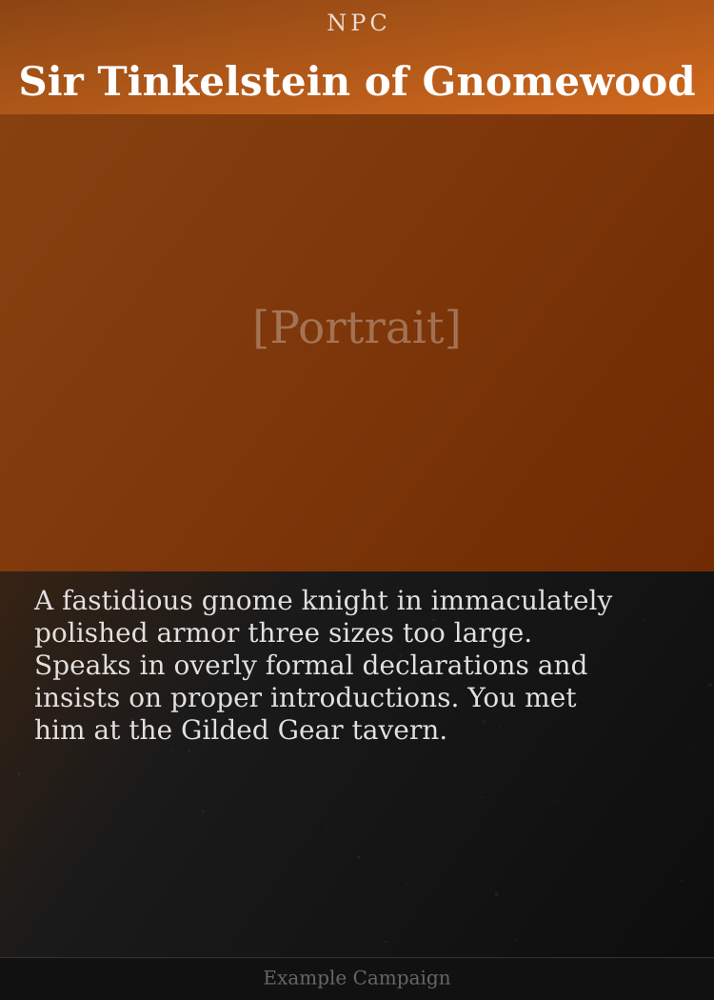
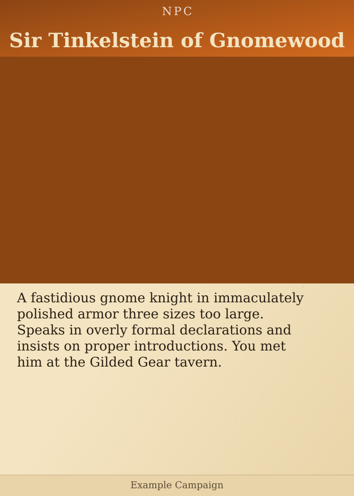
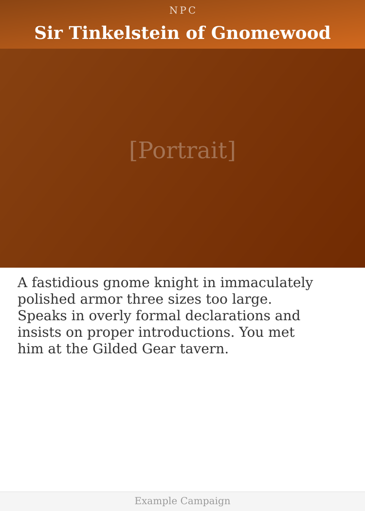
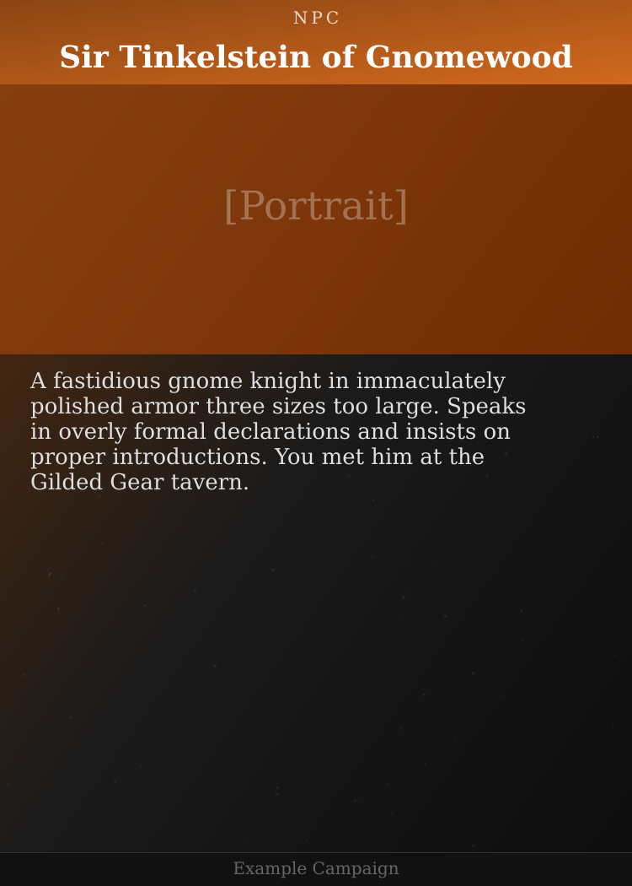
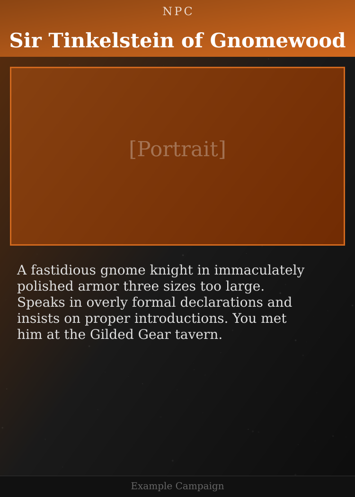

# Layout Comparison

Same card content rendered in 5 different styles. Pick which ones to keep.

---

## Dark (current default)

Dark textured background, light text. Full-width portrait.

---

## Parchment

Aged paper look, dark text. Full-width portrait.

---

## Minimal

Clean white background, no texture. Full-width portrait.

---

## Compact

Smaller portrait (320px vs 480px), more room for longer descriptions. Full-width portrait.

---

## Framed

Portrait with decorative border and margin. Not full-width.

---

## Feedback

Comment with which layouts to keep:
- **"Keep dark and framed"** → Archive the others
- **"Only dark"** → Use as sole style
- etc.
