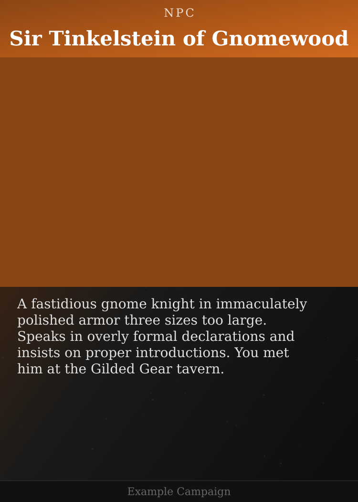
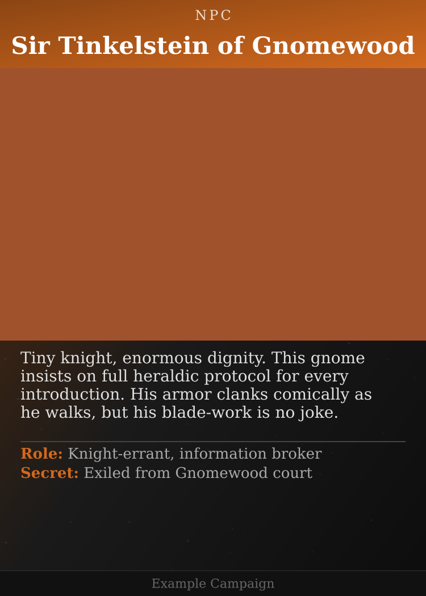
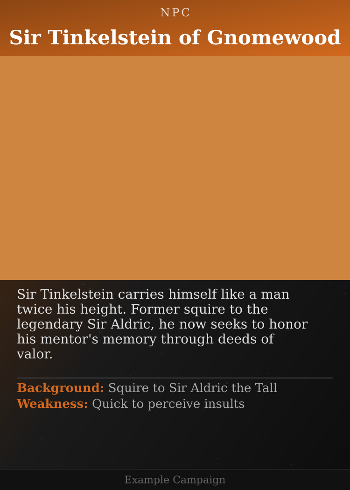
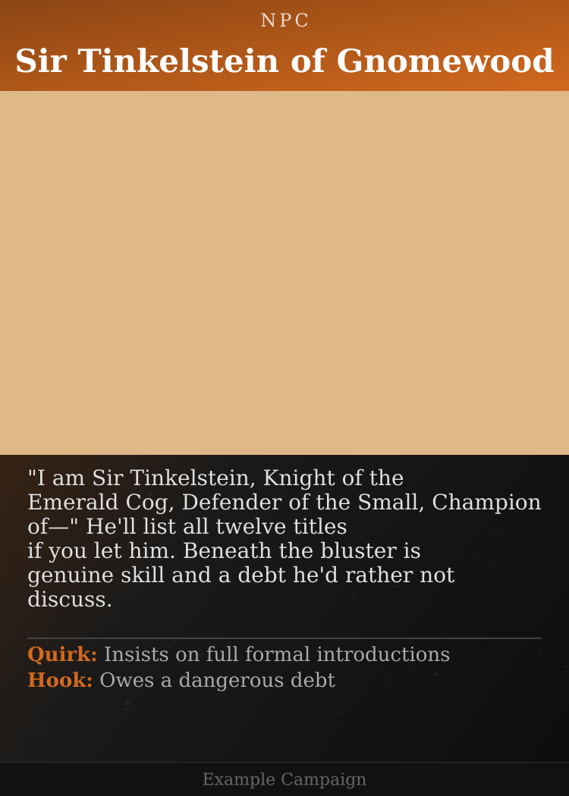
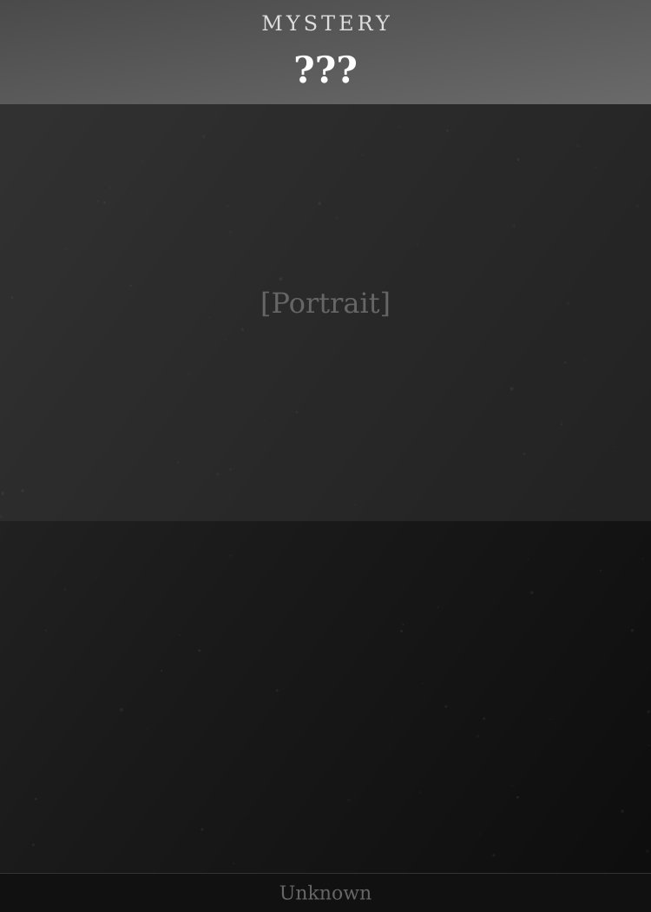

# Sir Tinkelstein of Gnomewood - Card Variants

**Category**: NPC
**Status**: Pending review

> **Note**: Cards are player-facing. Text describes only what players observed—appearance, demeanor, context of encounter. No secrets, hooks, or GM info.

---

## Variant 1 (Recommended)

> A fastidious gnome knight in immaculately polished armor three sizes too large. Speaks in overly formal declarations and insists on proper introductions. You met him at the Gilded Gear tavern.

---

## Variant 2

> Tiny knight, enormous dignity. His oversized armor clanks comically as he walks, but his swordsmanship is clearly practiced. Met at the Gilded Gear where he was loudly debating the finer points of chivalric conduct.

---

## Variant 3

> A gnome who carries himself like a man twice his height. His armor bears the heraldry of a human knight—perhaps inherited? Seemed touchy when someone laughed at his formal manner.

---

## Variant 4

> "I am Sir Tinkelstein, Knight of the Emerald Cog, Defender of the Small, Champion of—" He listed all twelve titles before you could interrupt. Wears elaborate but well-worn armor covered in medals and decorations.

---

## Mystery Card (for unknown NPCs)

Blank cards for NPCs the party hasn't properly met yet. Players can scribble notes on the printed card, then swap it for the real card once they learn more.

---

## Feedback

Comment on this PR:
- **"Use v2"** → Make variant 2 canonical
- **"v1 text + v3 image style"** → Combine elements
- **"Make description shorter"** → Adjust text
