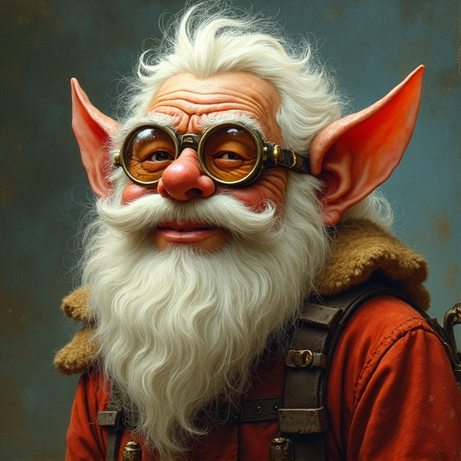
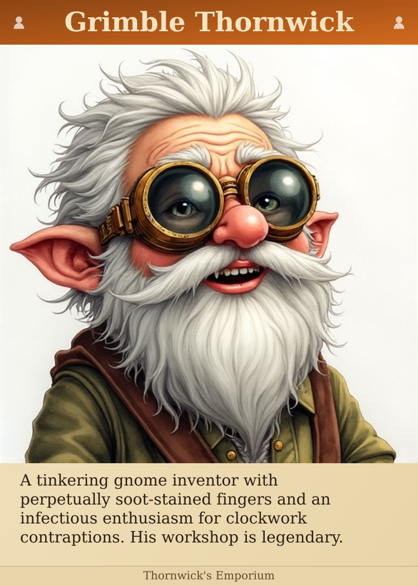
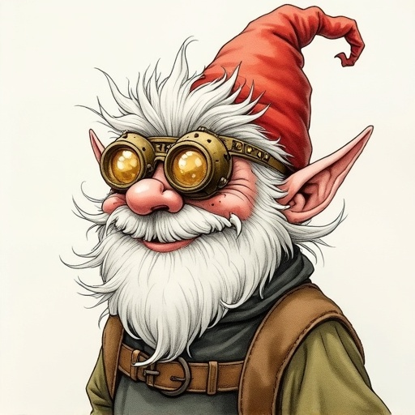
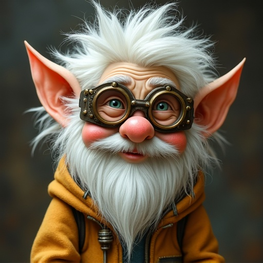
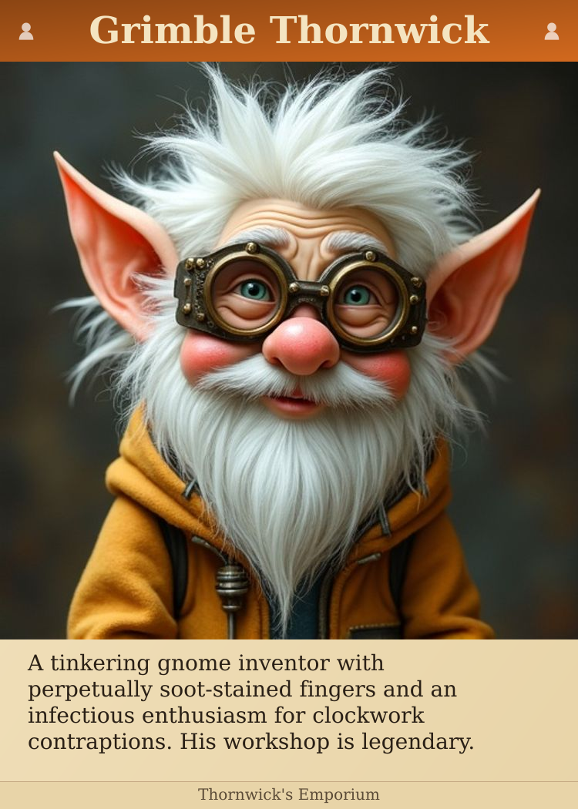

# Art Style Comparison

Same character rendered in different artistic styles. Each row shows:
1. **Portrait** - The AI-generated image
2. **Complete Card** - How it looks on the final card

---

## Classic Dnd

| Portrait | Complete Card |
|----------|---------------|
|  |  |

---

## Oil Painting

| Portrait | Complete Card |
|----------|---------------|
|  |  |

---

## Watercolor

| Portrait | Complete Card |
|----------|---------------|
|  |  |

---

## Ink Wash

| Portrait | Complete Card |
|----------|---------------|
|  |  |

---

## Storybook

| Portrait | Complete Card |
|----------|---------------|
|  |  |

---

## Renaissance

| Portrait | Complete Card |
|----------|---------------|
|  |  |

---

## Your Feedback

Which art style(s) work best for your cards?

Preferences:

Notes (consistency, printing concerns, etc.):
